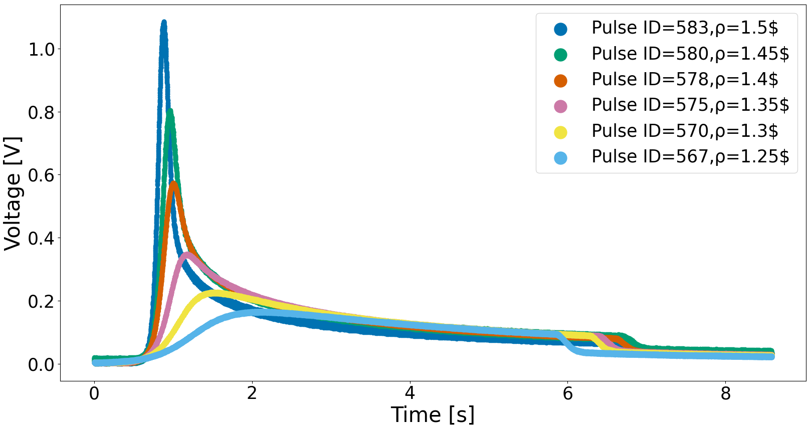

# JSI pulse recorder
## Table of contents
* [General info](#general-info)
* [Technologies](#technologies)
* [Setup](#setup)

## General info
In most water-cooled nuclear reactors, except zero-power reactors, Cherenkov radiation is present. It is due to energetic charged particles traveling faster than the speed of light in a dielectric medium. In open pool reactors, Cherenkov radiation can be observed as a blue glow around the reactor core. Since the intensity of the Cherenkov light produced in the reactor cooling water is in principle proportional to the neutron flux during a reactor pulse, an alternative method to measure the time dependence of the reactor power based on Cherenkov light intensity measurements is implemented at the JSI TRIGA research reactor.

The Cherenkov Pulse Recorder is based on a closed tube in order to avoid interference from external light sources and radiation damage experienced by optical fibers. The system consists of an aluminium tube with an inner diameter of 36 mm positioned in the reactor core periphery, containing 0.65 l of water (filling the height of the reactor core in the tube). The water serves as the source of Cherenkov radiation in the measurement system. The Cherenkov light intensity in the channel is measured by silicon photo multiplier (SiPM) based detector linked with Redpitaya data acquisition system. With the use of neutral-density filters (ND filters), located in front of the SiPM dynamic range of the detector, is adjusted.
<p>

<figcaption> Reactor power vs. time in pulse operation mode measured using the JSI Cherenkov pulse recorder </figcaption>
<p/>

## Technologies
Project is created with:
* Python 3.8
* Tkinter
* Pandas
* NumPy
* Matplotlib
* SciPy
	
## Setup
To run this project, copy the repository to your computer and start it with:
```
$ python3 app_test_mac.py
```
## Links
* [Testing a new exercise at the JSI TRIGA reactor - Cherenkov radiation-based power meter](https://www.eneep.org/news/testing-new-exercise-jsi-triga-reactor-cherenkov-radiation-based-power-meter/),

* [Reactor Pulse Operation for Nuclear Instrumentation Detector Testing – Preparation of a Dedicated Experimental Campaign at the JSI TRIGA Reactor](https://www.epj-conferences.org/articles/epjconf/pdf/2021/07/epjconf_animma2021_04019.pdf).
